# ESlint：守住优雅的护城河


[本文配套PPT](./eslint.pdf)

- [Web：一路前行一路忘川](../history/README.md)
- [Node.js：换个角度看世界](../node/README.md)
- [CommonJS：不是前端却革命了前端](../module/README.md)
- [Babel：把 ES6 送上天的通天塔](../babel/README.md)
- [ESlint：守住优雅的护城河](../eslint/README.md)
- [webpack：它是如此，但远不止于此](../webpack/README.md)

## 前言

战国时期强大的赵国想要一举攻打并吞并北边的燕国，而小国“梁城”位居两国之间，为战略要冲，是必取之地。于是赵国派遣大将巷淹中，率领十万大军攻打仅有四千人的“梁城”，梁城王向以守城著称的墨家求救。但梁城等到的却是一个其貌不扬、孤身应战的墨家侠客革离，谁料革离足智多谋，指挥梁城四千军民抵御十万赵军，功成身退。


“梁城”就好比我们的项目仓库，“梁城”的秩序取决于“革离”有没有守好它！那我们的项目仓库呢？你愿意看到城中杂乱无章、毫无规则、乱象丛生还是愿意看到城中秩序井然、风格统一、整齐有序？如何成里程序员里的“革离”，守好属于我们的天空之城？

## 关于 ESLint

### ESLint 是什么

先来看下它在[官网](https://eslint.org/)上的定义：

**Find and fix problems in your JavaScript code**

没错就一句话，**发现并修复你 JavaScript 代码中的问题**！

ESLint 最初是由 Nicholas C. Zakas 于 2013 年 6 月创建的开源项目。它的目标是提供一个插件化的 JavaScript 代码检测工具。

那为什么需要 JavaScript 代码检查工具呢？还是从 JavaScript 的语言特性说起。

### lint 工具进化史

在 C 语言发展初期，源程序中存在很多不可移植的代码，但却不能被编译器识别，因此贝尔实验室 SteveJohnson 于 1979 年在PCC(PortableC Compiler)基础上开发了一个静态代码分析的工具，用来扫描 C 源文件并对源程序中不可移植的代码提出警告，这个工具被起名为 lint ，也因此后续类似的检查代码的工具都叫 xxLint。 

我们在[《Web：一路前行一路忘川》](../history/README.md)中讲过 JavaScript 语言的历史，有提到 JavaScript 是在 1995年4月，由 Netscape 公司雇佣的程序员 Brendan Eich 开发的网页脚本语言，目的是嵌入到网页中在提交前做一些简单的校验。Brendan Eich 只用了10天，就设计完成了这种语言的第一版，估计作者也不曾想过 JavaScript 这门语言会发展到今天这个地步，所以在当初设计时存在非常多的不合理的地方。于是就需要代码校验工具来分析使用不当的地方，JSlint 就应运而生，在 JavaScript 语言 lint 工具进化史中，有三个里程碑式的工具：JSLint、JSHint 和 ESLint。

### 开山鼻祖 JSLint


2008年，有一本非常著名的书《JavaScript语言精粹》出版，因为封面图是一个蝴蝶，所以俗称"蝴蝶书"。非常薄的一本书，是适合所有入门 JavaScript 必读并且要读很多遍的一本书。这本书的作者叫 Douglas Crockford。

> Douglas Crockford 是一名来自 Yahoo! 的资深 JavaScript 架构师，以创造和维护 JSON (JavaScriptObject Notation) 格式而为大家所熟知。他定期在各类会议上发表有关高级 JavaScript 的主题演讲。他也是 ECMAScript 委员会的成员之一。


从《JavaScript语言精粹》的书名就可以看出来，全书悉数了 JavaScript 语言的优美特性，同时在书籍的最后面，作者也毫不客气的列举了 JavaScript 的糟粕和鸡肋的地方，从书籍中的笔风就能看出，Douglas 是个眼里容不得瑕疵的人，于是在书籍最后也介绍了作者在 2002 年开发的 JSLint 工具，Douglas 定义了所有 JSLint 的规则，对于糟粕的语法是严格不让使用的，如果你要使用JSLint，就必须接受它所有规则。

### 继往开来 JSHint


2011 年 12 月 20 日，Anton Kovalyov 发表了一篇标志性的文章：[Why I forked JSLint to JSHint](https://medium.com/@anton/why-i-forked-jslint-to-jshint-73a72fd3612)，指出了 JSLint 存在的几个主要问题：

* 令人不安地固执己见，没有提供一些规则的配置
* 对社区反馈不关注

于是 JSHint 就诞生了，它在 JSLint 的基础上，在社区开发者共同努力下，加入了如下特性：

* 更多可配置的规则，这是社区的核心诉求
* 代码模块化
* 命令行工具的支持，很好得和各种 IDE 集成

诸多优势，让 JSLint 迅速取代 JSHint 成为一种必然。

### 重新出发 ESLint

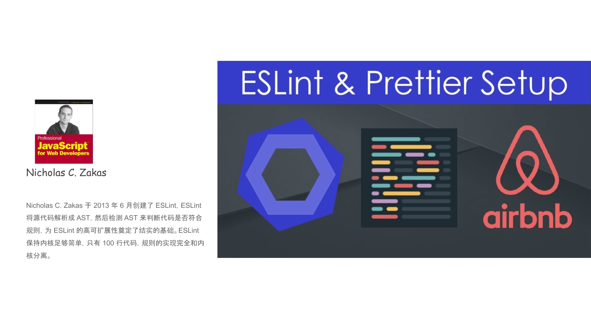

JSLint 是从 JSHint 继承而来，所以沿用了 [JSLint Top Down Operator Precedence](http://crockford.com/javascript/tdop/tdop.html)（自顶向下的运算符优先级）技术实现源码的解析，但前端爆发式增长带来的巨大需求让 JSHint 变得愈加难以应对，通过暴露 AST 信息来支持第三方插件无疑是一剂良方。

> AST：[抽象语法树](https://en.wikipedia.org/wiki/Abstract_syntax_tree)

于是《JavaScript 高级程序设计》作者 Nicholas C. Zakas 于 2013 年 6 月创建了 ESLint，ESLint 将源代码解析成 AST，然后检测 AST 来判断代码是否符合规则，为 ESLint 的高可扩展性奠定了结实的基础。ESLint 保持内核足够简单，只有 100 行代码，规则的实现完全和内核分离。

但是，那个时候 ESLint 并没有大火，因为需要将源代码转成 AST，运行速度上输给了 JSHint ，并且 JSHint 当时已经有完善的生态（编辑器的支持）。真正让 ESLint 大火是因为 ES6 的出现。

> 参考[Web：一路前行一路忘川](../history/README.md)中 ES6 的相关内容。

ES6 发布后，因为新增了很多语法，JSHint 短期内无法提供支持，而 ESLint 只需要有合适的解析器就能够进行 lint 检查。这时 Babel 为 ESLint 提供了支持，开发了 babel-eslint，让 ESLint 成为最快支持 ES6 语法的 lint 工具。


## ESLint 怎么用

了解了 ESLint 工具的历史意义和发展过程，接下来看下 ESLint 到底怎么用？

### 给项目安装 ESLint

> 先决条件：Node.js (>=6.14), npm version 3+。

```
// 新建demo工程目录，初始化 npm 项目
npm init

// 安装 eslint    推荐安装为项目的开发依赖
npm i -D eslint

// 初始化 eslint 配置文件    因为不是安装到全局的，所以不能直接使用 eslint --init
./node_modules/.bin/eslint --init
```

在初始化的过程中，会让你选择一些配置，譬如 如何使用 ESLint？我们选择第三项，功能最多。


逐一选择完 ESLint 的使用配置后，会在项目根目录生成 `.eslintrc.js` 配置文件，同时会安装需要的 npm 包。 demo 中安装的 npm 包有：

`eslint-config-standard`、`eslint-plugin-import`、`eslint-plugin-node`、`eslint-plugin-promise`、`eslint-plugin-standard`

demo 中选择如下所示：

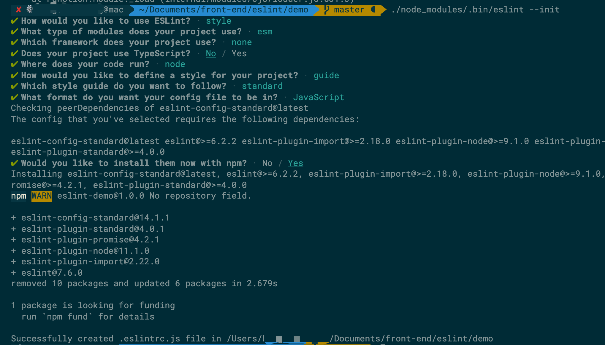

初始化后，生成的配置内容如下所示，具体配置项的含义，后面我们再聊

```js
// .eslintrc.js
module.exports = {
  env: {
    es2020: true,
    node: true
  },
  extends: [
    'standard'
  ],
  parserOptions: {
    ecmaVersion: 11,
    sourceType: 'module'
  },
  rules: {
  }
}
```

**需要强调的是在选择代码风格时，我选择了比较流行的 [standard](https://github.com/standard/standard/blob/master/docs/README-zhcn.md) 规范。**

接下来我们就可以使用 ESLint 来检查和修复代码了。首先在 demo 项目中，新建 src 目录，并新建 index.js 文件，内容如下：

```js
// src/index.js
let a = 10;
let b = 15;
let sum = a + d;
console.log(sum);
```
同时，在 package.json 中，增加 eslint 命令 `eslint src/**` 来检查 src 目录下的所有文件。
```json
//package.json
"scripts": {
  "eslint": "eslint src/**"
}
```

在 demo 目录执行 `npm run eslint` 结果如下：

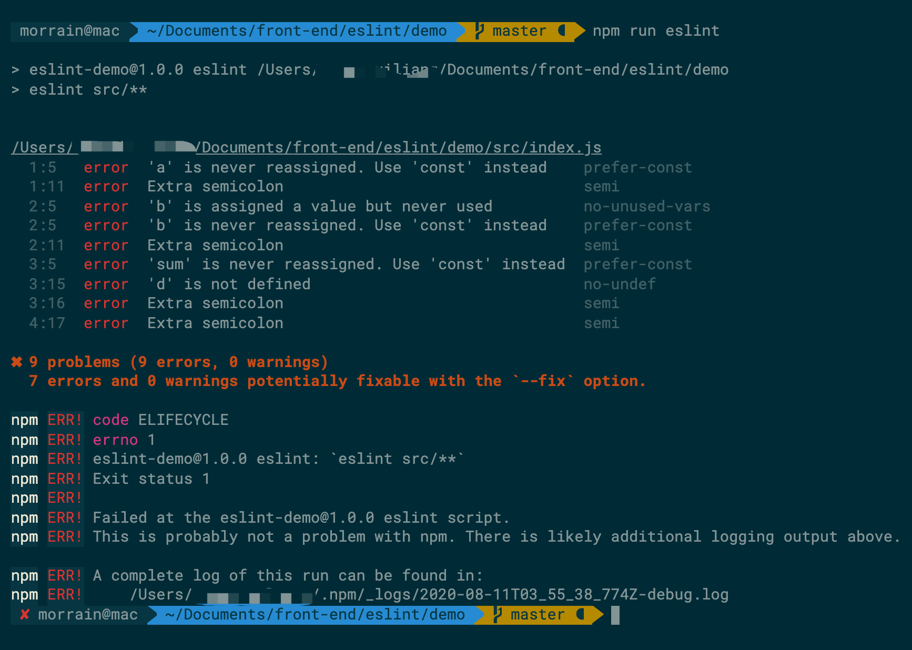

可以看到，检查出来了如此多的错误，其中‘let 要使用 const 替换’，‘不能使用封号’等属于 `standard` 规范中指定的规则，除了风格外，还检查出了‘未定义的变量’等语法错误，并逐一给出提示。

 如果想自动修复检查出来的问题，怎么办呢？ eslint 支持使用 `--fix` 参数。修改 package.json 中的 eslint 命令为 `eslint src/** --fix`

 再次执行 `npm run eslint` 结果如下：

 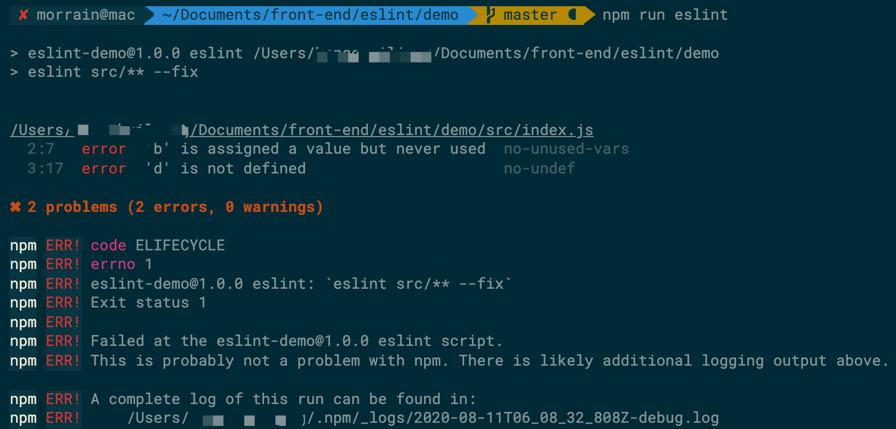

 打开 `src/index.js` 文件发现，内容已经发生了改变：

 ```js
// src/index.js
const a = 10
const b = 15
const sum = a + d
console.log(sum)
```

**可以看到，ESLint 自动修复了可以被修复的风格问题，同时对于不能被自动修复问题给出提示。**

> 更多 eslint cli 配置参数,请参考官网 [cli](https://cn.eslint.org/docs/user-guide/command-line-interface) 的详细介绍。

到这里我们已经‘挖好了护城河’，可是河里并没有水，敌人想要过来依然可以畅行无阻。完全依赖开发人员自觉手动运行 `npm run eslint` 来完成，那怎么样才能让让‘护城河’真正发挥作用呢？我们先看下 ESLint 常见的配置含义，然后在 [如何守住优雅的护城河](#如何守住优雅的护城河)详细介绍。

### 常用配置规则

刚才在初始化之后，在项目根目录生成了 .eslintrc.js 文件，这里存放了所有 eslint 的配置项。

```js
module.exports = {
  env: {
    es2020: true,
    node: true
  },
  extends: [
    'standard'
  ],
  parserOptions: {
    ecmaVersion: 11,
    sourceType: 'module'
  },
  rules: {

  }
}
```

#### 环境与全局变量

demo 中的 env 配置就是为相应的环境定义了一组预定义的全局变量。从之前的例子中我们已经看到，ESLint 会检测出来未定义的变量并报错，但有一些是运行环境或者框架提供的全局变量，譬如 jQuery 提供的 `$`，此时有如下几种解决方案：

1. 在你的 JavaScript 源码文件中，用注释指定全局变量，格式如下：

```js
/* global $ */

const dom = $('id')
```

2. 在配置文件中配置全局变量，将 globals 配置属性设置为一个对象，该对象包含以你希望使用的每个全局变量。对于每个全局变量，将对应的键值设置为 "writable" 以允许重写变量，或 "readonly" 不允许重写变量。例如：

```json
{
    "globals": {
        "$": "readonly"
    }
}
```
3. 使用 env 配置。为了避免上面两种方案需要一一配置每一个全局变量的麻烦，ESLint 预设了好多环境全局变量集合，譬如我们要使用 jQuery 提供的全局变量，只要需要在 env 配置中添加 `jquery:true`就可以了。

demo 中 env 的配置，`es2020:true` 表示增加了 es2020 的语法特性，`node:true` 表示增加 node 中所有的全局变量。更多的环境可以参考官网 [指定环境](https://cn.eslint.org/docs/user-guide/configuring#specifying-environments) 相关章节。

#### 扩展

在 .eslintrc.js 中 rules 用来配置 ESLint 的规则，具体配置规则的方法请参考官网 [如何配置规则](https://cn.eslint.org/docs/user-guide/configuring#configuring-rules) 以及 [所有规则的说明](https://cn.eslint.org/docs/rules/)，这里不作详细介绍，同样为了方便使用，ESLint 使用 `extends` 配置来一次性生效一整套规则。譬如 demo 中 `rules` 中没有配置任何规则，因为通过 `extends` 配置了符合 `standard` 规范的规则集合。

ESLint支持三种类型的扩展：

1. 'eslint:' 开头的 ESLint 官方扩展。包括 `eslint:recommended` 和 `eslint:all`，其中 `eslint:recommended` 是推荐的一套规则，`eslint:all` 是 ESLint 中的所有规则，不推荐使用，因为可能随时被 ESLint 更改。

2. 共享的扩展。通过 npm 提供一套共享的配置，包名前缀必须为 `eslint-config-`，`extends ` 属性值可以省略包名的前缀 `eslint-config-`。demo 中 `stanard` 对应的就是 package.json 中 'eslint-config-standard' 这个包提供的一套规则。

3. 插件中提供的扩展。在 demo 初始化时，我们可以看到 `eslint-plugin-node` 等插件包被安装，这些插件包是 `eslint-config-standard` 的依赖，所以会被自动安装，这些插件包也提供了一些规则可供扩展。

    譬如如下代码在 node 的模块中写法是错误的，应该写成 `module.exports`，如果想要 ESLint 能检查出这个错误，就需要增加 `eslint-plugin-node` 包中提供的规则到扩展中。

    ```js
    // src/index.js
    exports = {
      foo: 1
    }
    ```
    ```js
    // .eslintrc.js
    extends: [
      'standard',
      'plugin:node/recommended'
    ],
    ```

    > 由于 `eslint-plugin-node` 已经被默认安装了，所以不需要再单独安装，对于没有安装的插件包，如果想使用它提供的规则，需要手动安装这个插件包。

#### 插件

上面讲扩展时，已经提到了如何加载插件中的扩展配置。既然已经有了这么多扩展可以使用，为什么还需要插件呢？因为 ESLint 只能检查标准的 JavaScript 语法，如果你使用 Vue 单文件组件， ESLint 就束手无策了。这个时候，相应框架就会提供配套的插件来定制特定的规则进行检查。插件扩展类似，也有固定的前缀 `eslint-plugin-`，配置时可以有省略前缀。

我们新加一个 Vue 的单文件组件如下，执行 `npm run eslint` 后发现没有效果，并不能检查 .vue 中的错误，此时就需要安装 `eslint-plugin-vue` 插件。

```html
// src/index.vue
<script>
let a = 10
const b = 15
const sum = a + d
console.log(sum)
</script>
```

```
npm i -D eslint-plugin-vue
```
安装后在 .eslintrc.js 中配置插件，有两种方式

1. 通过 plugins 配置

    ```js
    module.exports = {
      plugins: ['vue']
    }
    ```
    配置完成执行 `npm run eslint` 发现并没有检查 src/index.vue 文件，原来 ` plugins: ['vue']` 只是声明想要引用的 `eslint-plugin-vue` 提供的规则，但是具体用哪些，怎么用，还是需要在 rules 中逐一配置。所以一般我们使用第二种方式配置插件。

2. 通过 extends 配置，即上述的配置扩展的方式。

    ```js
    module.exports = {
      extends: ['plugin:vue/recommended']
    }
    ```
    通过这种方式既加载了插件又指定了使用插件提供的规则，已经能成功检查 vue 文件中上的代码，如下图所示：
    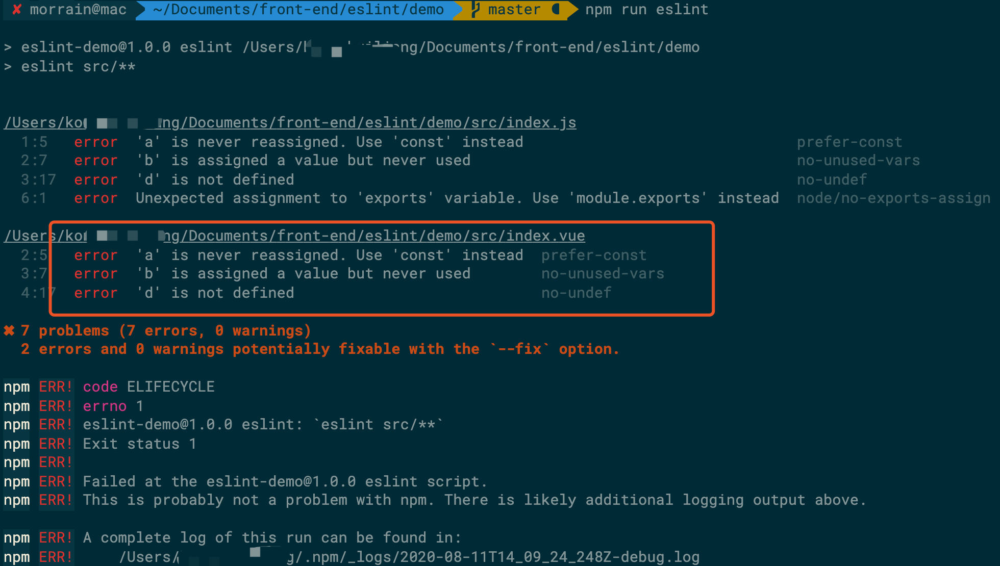

#### 解析器及其配置

```js
module.exports = {
  parserOptions: {
    ecmaVersion: 11,
    sourceType: 'module'
  }
}
```

demo 中 parserOptions 为解析器配置，ESLint 默认只支持 ES5 的语法，但可以通过解析器配置来设置支持的 ES 版本，譬如 demo 中的 `ecmaVersion:11` 表示支持 ES11(即ES2020) 的语法，**这里需要注意的是通过解析器配置只是支持语法，对于该版本新增加的全局变量依然要通过 `env` 配置来完成支持，相关说明以及更多的解析器配置请参考官网 [指定解析器配置](https://cn.eslint.org/docs/user-guide/configuring#specifying-parser-options)** 

ESLint 默认是使用 [ESPree](https://github.com/eslint/espree) 作为其解析器的，但也可以通过 parser 字段指定一个不同的解析器，可以参考官网 [指定解析器](https://cn.eslint.org/docs/user-guide/configuring#specifying-parser)。

那为什么需要指定解析器呢？因为 ESLint 默认的解析器只支持已经形成 ES 标准的语法特性，对于处于实验阶段以及非标准的（譬如 Flow、TypeScript等）需要使用 Babel 转换的语法，就需要指定由 Babel 提供的 `@babel/eslint-parser` 了。由此可见，正常情况下，是不需要指定第三方的解析器的。

以 `@babel/eslint-parser` 为例，当指定它作为 ESLint 的解析器后，我们开发的源码首先由 `@babel/eslint-parser` 根据 Babel 的配置([参考Babel:把 ES6 送上天的通天塔](../babel/README.md)) 把源码转化为 ESLint 默认支持的 AST，并保持住源码的行列数，方便输出错误的定位。 光指定 `@babel/eslint-parser` 还不够，解析器的作用只是负责把 ESLint 不能识别的语法特性转化为 ESLint 能识别的，但它本身不包括规则，还需要使用 `@babel/eslint-plugin` 插件来提供对应的规则，才能正常执行 ESLint 对代码的检测。

> 更多详情，请参考 [@babel/eslint-parser](https://github.com/babel/babel/tree/master/eslint/babel-eslint-parser)  官方文档

至此，常见的配置已经介绍完了，更多配置介绍，请参考 ESLint 官网文档 [配置 ESLint](https://cn.eslint.org/docs/user-guide/configuring)


## 如何守住优雅的护城河

前面也提到了到目前为止，我们只是‘挖好了护城河’，可是河里并没有水，敌人想要过来依然可以畅行无阻。源码检测完全依赖开发人员自觉手动运行 `npm run eslint` 来完成，那怎么样才能让让‘护城河’真正发挥作用呢？

### 享受开发时的乐趣

**首当其冲的需求就是在开发的过程中最好就能做代码检测**，而不是需要代码开发完成后，运行 `npm run eslint` 才能看到错误，此时可能已经一堆错误了。

以 VS Code 编辑器为例（其它编辑器应该也有类似的插件），安装 [ESLint 扩展插件](https://marketplace.visualstudio.com/items?itemName=dbaeumer.vscode-eslint) 。该编辑器插件会读取当前项目中的 .eslintrc.js 的配置，并在编辑器中提示出来。

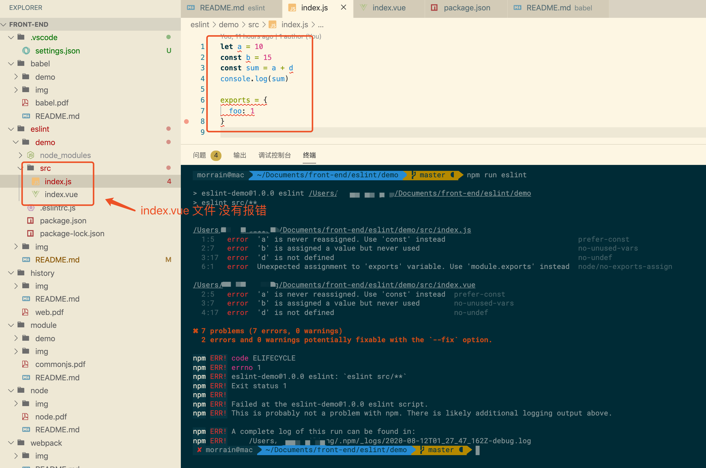

首先可以看到目录树上，有问题的文件变红，点开这个文件，对应的行上也会有错误提示，鼠标停留会提示错误的信息方便修复。但眼尖的同学可能已经发现了，运行 `npm run eslint` 不光能检测 index.js 中的错误，还能检测 index.vue 中的错误，一共是 7 个错误。而编辑器只检测了 index.js 的错误。

**原来是编辑器的 ESLint 插件默认只能检测 .js 的文件，需要调整编辑器 ESLint 插件的设置，让它支持 .vue 文件的检测。** 

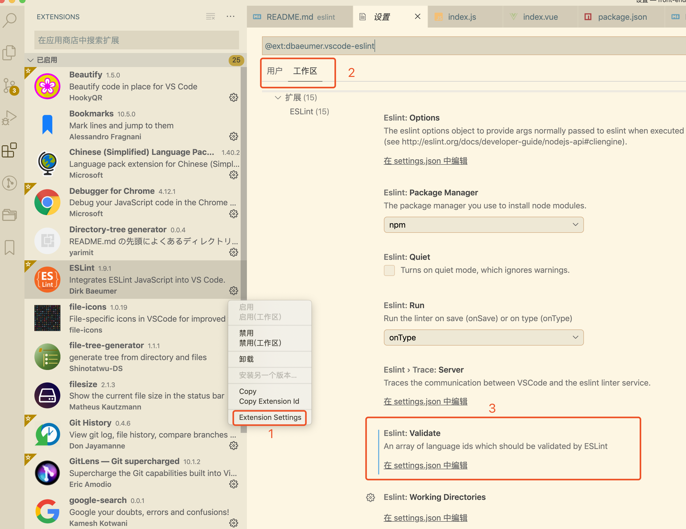

如上图所示：

1. 找到插件的设置入口

2. 因为增加对 vue 文件的支持是针对项目的，并不是所有项目都是 vue 项目，所以我们把设置生效到工作区

3. 在 Validata 配置中增加 vue

    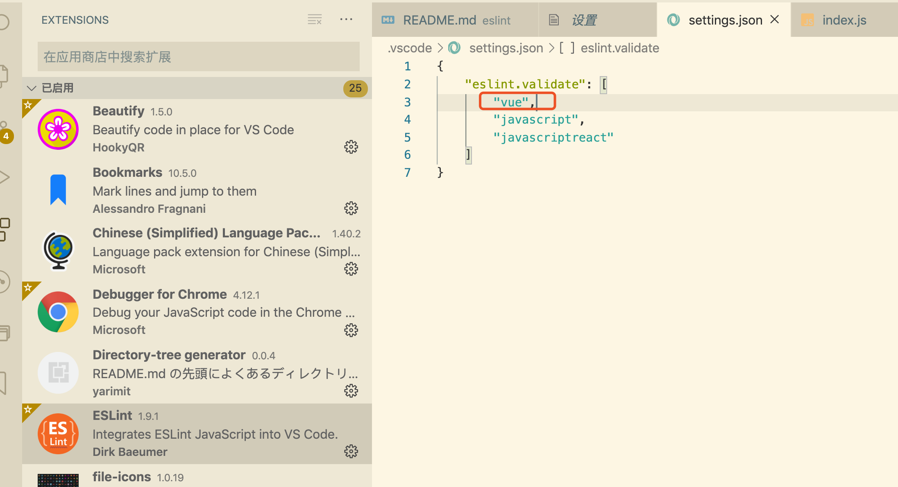

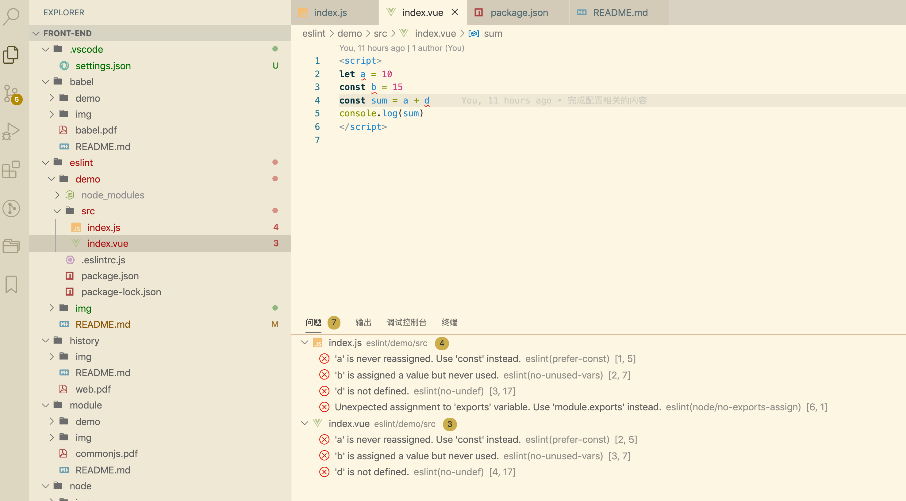

可以看到，index.vue 文件也已经变红，里面的错误也能够被检测了，并且在编辑器的“问题”栏也能显示项目所有的 7 条错误，和运行 `npm run eslint` 效果一样了。

这样一来，开发时就能有错误提示，根据提示修改就好了，但我们之前提到运行 `npm run eslint` 可以通过 `--fix` 参数来自动修复可以修复的问题，譬如格式问题，`let` 改成 `const` 等这些问题。

**那在开发时，是否也可以对于检测出来的错误自动修复呢？**

三种方案，可以根据自喜好选择：

1. 设置保存时自动修复

    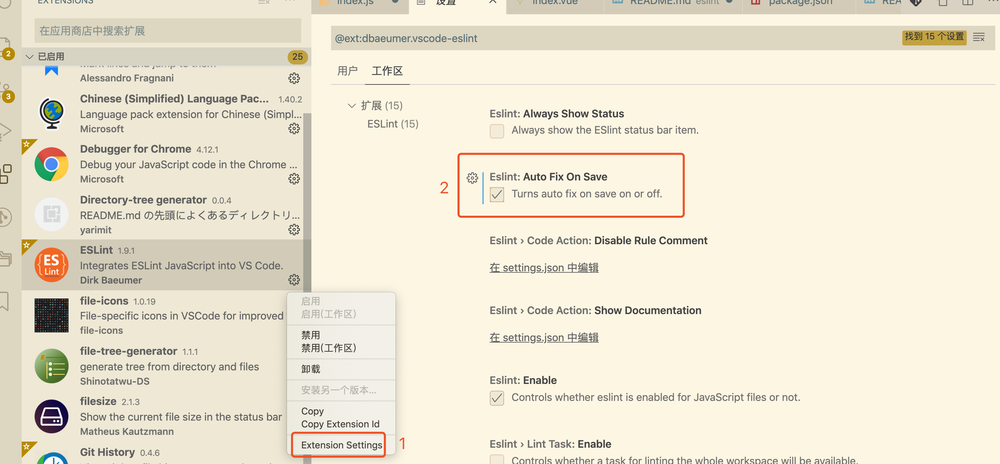

2. 调出 VS Code 编辑器的命令面板，找到 ESLint 插件提供的修复命令

    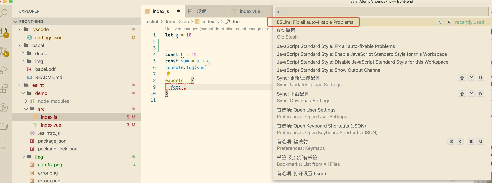

3. 将 ESLint 插件提供的修复命令设置成喜欢的快捷键，使用快捷键修复

此时我们发现，自动修复又是只针对 index.js 文件生效，同样的依然要配置 ESLint 的插件，使其支持 Vue 文件的自动修复功能。


### 将乐趣进行到底

现在我们已经能做到了，在开发时检测出来错误并且方便开发修复问题，这依赖于开发同学自觉，如果开发同学不自觉或者忘记了，此时提交代码就依然会把错误的代码提交到仓库中去。此时我们需要借助 [husky](https://github.com/typicode/husky#readme) 来拦截 git 操作，在 git 操作之前再进行一次代码检测。

1. 安装并配置 husky

```
npm i -D husky
```

```json
// package.json
{
  "husky": {
    "hooks": {
      "pre-commit": "eslint src/** --fix"
    }
  }
}
```


此时提交前会检查 src 下的所有文件，由于 demo 中源码是有问题的，ESLint 检查通不过，所以现在无法提交，从而阻断开发忘记修复 ESLint 检查出来问题的情况。

那对于老的项目，可以已能存在很多遗留的风格问题，导致 ESLint 检查通不过，此时又不可能把所有问题都一一修复掉，阻止提交势必会造成影响。另外对于单次提交而言，如果每次都检查 src 下的所有文件，也是没有必要的。所以我们需要使用 [lint-staged](https://github.com/okonet/lint-staged) 工具只针对当前修改的部分进行检测。

2. 安装并配置 lint-staged

```
npm i -D lint-staged
```

```json
// package.json
{
    "husky": {
    "hooks": {
      "pre-commit": "lint-staged"
    }
  },
  "lint-staged": {
    "*.{js,vue}": [
      "eslint --fix",
      "git add"
    ]
  }
}
```

具体配置请参考 [lint-staged](https://github.com/okonet/lint-staged) 官网文档。示例中配置表示的是，对当前改动的 .js 和 .vue 文件在提交时进行检测和自动修复，自动修复完成后 add 到 git 暂存区。如果有无法修复的错误会报错提示。

### 安装“黑匣子”

飞机上都装有黑匣子，当出现故障时，可以很方便的回溯航行记录，发现问题。我们的代码仓库也一样，每次提交都应该有记录。但每个同学提交时的信息各不一样，没有统一的格式，导致后面回溯提交记录时眼花缭乱，效率很低。

接下来看下，如何约束提交，来守住提交日志优雅的这道大门。

[commitizen](https://github.com/commitizen/cz-cli) 是用来格式化 git commit message 的工具，它提供了一种问询式的方式去获取所需的提交信息。

[conventional-changelog](https://github.com/conventional-changelog/conventional-changelog) 是用来规定提交时需要输入哪些信息，譬如提交的类型是修复问题还是功能开发，提交影响范围等等，conventional-changelog 是官网提供的规则，完全可以根据项目实际情况自已开发适合的规则。

[standard-version](https://github.com/conventional-changelog/standard-version) 提交信息并约束后，提交的日志信息就会比较统一，使用 standard-version 很容易自动生成提交的日志 CHANGELOG 文件

1. 安装并配置

```
npm i -D commitizen conventional-changelog standard-version
```

```json
//package.json
{
  "scripts": {
    "c": "git-cz",
    "version": "standard-version"
  },
  "standard-version": {
    "changelogHeader": "# Changelog\n\n所有项目的变更记录会记录在如下文件.\n",
    "dryRun": true
  },
  "config": {
    "commitizen": {
      "path": "cz-conventional-changelog"
    }
  }
}
```

配置完成后，使用 `npm run c` 来提交修改，会如现如下图所示的问询式的交互提示，根据规则要求填写对应的内容就好了。


通过此方式提交，提交的日志是格式统一的，然后就是使用 `npm run version` 来生成 CHANGELOG 文件了。

standard-version 会自动 bump 项目的版本号，并生成两个版本之间的提交日志记录文件，然后打个版本 tag 上传到仓库。更多关于 standard-version 的功能请参考官网文档 [standard-version](https://github.com/conventional-changelog/standard-version) 


### 最后一道防线

现在开发如果使用 `npm run c` 来提交修改，那么一切都会非常美好，可是万一开发忘了使用 `npm run c` 来提交修改，直接使用 git 命令，或者其它工具提交改动，怎么办？如何守好最后一道防线？

答案就是在提交时对提交信息进行校验，如果不符合要求就不让提交，并提示。校验的工作由 [commitlint](https://github.com/conventional-changelog/commitlint) 来完成，校验的时机则由 [husky](https://github.com/typicode/husky#readme) 来指定。 husky 继承了 Git 下所有的钩子，在触发钩子的时候，husky 可以阻止不合法的 commit，push 等等。

1. 安装并配置

    ```
    // 安装工具包
    npm install --save-dev @commitlint/{config-conventional,cli}

    // 生成 commitlint 配置文件 
    echo "module.exports = {extends: ['@commitlint/config-conventional']}" > commitlint.config.js
    ```

    `@commitlint/cli` 用来执行检查，`@commitlint/config-conventional` 是检查的标准，即提交的信息是否符合这个标准的要求，只有符合要求才允许提交。

    生成配置文件，指定要使用的规范，同时增加 husky 中的 'commit-msg' 钩子。配置完成后，再通过非 `npm run c` 途径的提交都会被拦截并报错。 

    ```json
    // package.json
    {
      "husky": {
        "hooks": {
          "pre-commit": "lint-staged",
          "commit-msg": "commitlint -E HUSKY_GIT_PARAMS"
        }
      }
    }
    ```

2. 错误提交时的校验

    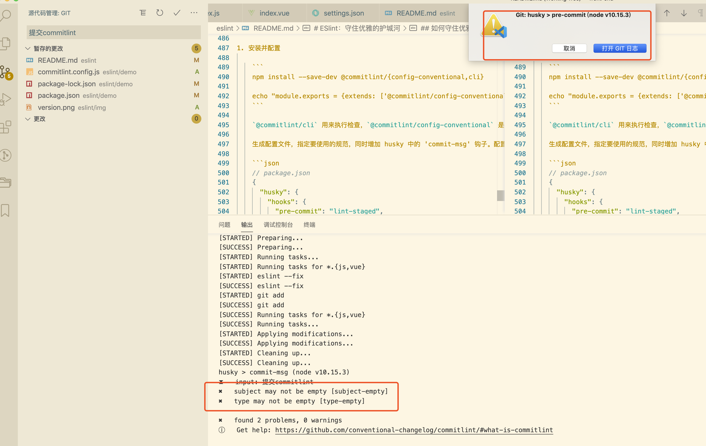

## 总结

基于 ESLint ，我们成功化身为程序员界的‘革离’，守好了我们的战场，让属于我们的天空之城干净纯粹、整齐划一，在优雅里翱翔！

下一节，我们聊聊打包工具 webpack

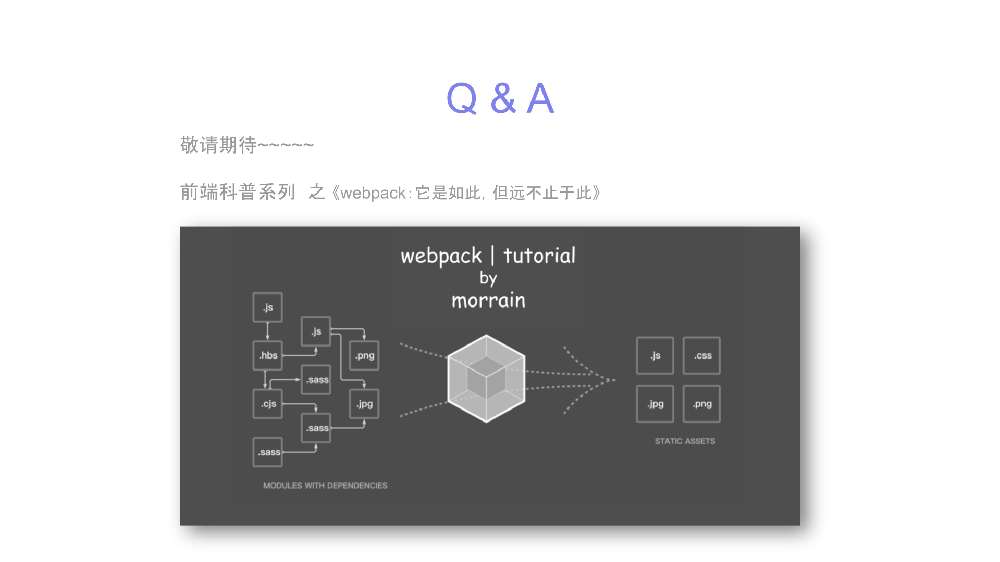

## 参考文献

[深入理解 ESLint](https://juejin.im/post/6844903901292920846)

[ESLint 官网](https://cn.eslint.org/)

[JS Linter 进化史](https://zhuanlan.zhihu.com/p/34656263/)

《JavaScript语言精粹》

[ESLint 工作原理探讨](https://zhuanlan.zhihu.com/p/53680918)


